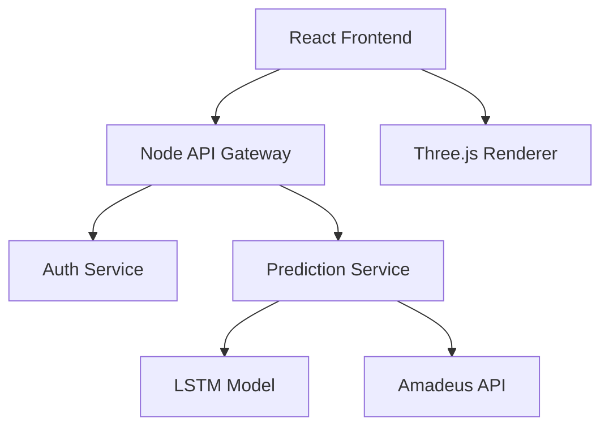

# JetLens-LSTM-NLP-MERN-Microservices
JetLens AI-powered flight booking platform that combines LSTM and NLP with a React/Three.js frontend. The Node.js microservice backend integrates Amadeus API for live flight data and Firebase for auth. Features include 3D seat visualization, real-time dashboards, and CI/CD deployment .

# 🛩️ JetLens: AI-Powered Flight Analytics Platform

  
*(Replace with actual project screenshot)*

## 🚀 Features & Tech Stack
| Component | Technology | Implementation Details |
|-----------|------------|------------------------|
| **AI Price Prediction** | PyTorch LSTM | 30-day lookback window • RMSE-optimized |
| **Natural Language Search** | HuggingFace Transformers | BERT-based intent classification |
| **3D Visualization** | Three.js + React Fiber | WebGL-rendered seat maps |
| **Microservices** | Docker + Node.js | Auth/Prediction/API Gateway services |
| **CI/CD** | GitHub Actions | Automated testing & deployment |

## 🧠 Core Architecture

.
├── ml-core/                # Machine Learning Models
│   ├── price_prediction/   # LSTM implementation
│   └── nlp_processing/     # Query understanding
├── frontend/               # React Application
│   ├── public/             # Static assets
│   └── src/
│       ├── features/       # Feature-based components
│       └── lib/            # Three.js utilities
├── services/               # Microservices
│   ├── auth/               # JWT authentication
│   └── prediction/         # Flask ML service
└── infra/                  # Deployment
    ├── Dockerfile          
    └── ci-cd/              # GitHub Actions workflows

